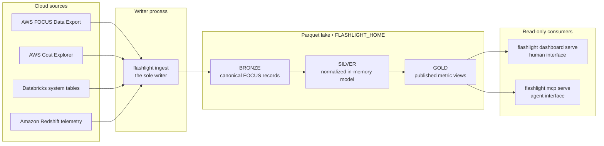

<p align="center">
  
</p>

<h1 align="center">Flashlight</h1>

<p align="center"><em>Make cloud spend easy to see.</em></p>

<p align="center">
  <a href="https://github.com/ychaparala/getflashlight/actions/workflows/ci.yml"></a>
  <a href="https://pypi.org/project/getflashlight/"></a>
  <a href="https://pypi.org/project/getflashlight/"></a>
  <a href="LICENSE"></a>
</p>

**FOCUS-based, multi-cloud cloud-spend visualization.**

Flashlight ingests cloud billing in the [FinOps FOCUS](https://focus.finops.org/focus-specification/)
format, standardizes it into a layered data model, and serves a bundled
**NiceGUI** dashboard plus an **MCP server** for agents. It answers one question
well: *what are we actually spending* — across every cloud and data platform on
one FOCUS-normalized bill, plus how much of it is recoverable waste.

It installs with `pip install getflashlight` — **no Docker, no database server**.
Persistence is Parquet under `FLASHLIGHT_HOME`, queried by an in-memory **DuckDB**.

> Flashlight identifies recoverable-spend candidates; it never applies cloud changes or
> performs automatic remediation.

**Cross-platform.** The lake home defaults to the OS user-data dir
(`platformdirs`) — `~/Library/Application Support/flashlight` on macOS,
`%LOCALAPPDATA%\flashlight\flashlight` on Windows, `~/.local/share/flashlight` on Linux
— or set `FLASHLIGHT_HOME` to override. Secrets load from a `.env` in the working
directory (or real shell env, which wins). Windows is supported: the atomic GOLD
publish retries the per-file rename to ride out a reader's brief open handle.

## Architecture



Flashlight has one writer and any number of readers. `flashlight ingest` writes
source data and publishes completed GOLD views. `flashlight dashboard serve` and
`flashlight mcp serve` each open their own in-memory DuckDB connection over that
published data; neither process changes the lake.

| Layer | Location | Purpose |
| --- | --- | --- |
| **BRONZE** | `bronze/` | Canonical FOCUS records, partitioned by connector and charge month. Re-ingestion replaces the requested partitions, so retries are idempotent. |
| **SILVER** | In memory | Cleaned, normalized source model. Every cost metric derives from its single canonical `EffectiveCost` column at charge-period grain. |
| **GOLD** | `gold/*.parquet` | Published metric contract for both the dashboard and MCP server. It is built with DuckDB and atomically published, so readers do not observe half-written results. |

There is no database server, REST API, or migration layer. Parquet is the persistent
store; `FocusRecord` is the canonical ingestion schema.

## Quick start

```bash
pip install getflashlight

# Load public FOCUS sample data into the local lake.
flashlight sample

# Open the dashboard at http://127.0.0.1:8501.
flashlight dashboard serve
```

`flashlight sample [--rows 1000|10000]` is the zero-config way to see the dashboard
with real data — it loads the CSV straight into Parquet via a vectorized DuckDB
projection (no per-row Python). For your own sources instead:

```bash
# Create <FLASHLIGHT_HOME>/config/ with commented starter files.
flashlight init

# Pull enabled connectors, then publish fresh GOLD metrics.
flashlight ingest
```

* Dashboard: `http://127.0.0.1:8501` (NiceGUI; consumer surface for humans)
* MCP: `http://localhost:8002` (`flashlight mcp serve`; streamable HTTP, for agents) —
  also startable and watchable from the dashboard's **MCP server** page. The port has no
  authentication, so set `FLASHLIGHT_MCP_HOST=127.0.0.1` unless you intentionally provide
  a private, authenticated network boundary.
* CLI: `flashlight init | ingest | transform | mcp serve | dashboard serve | aws create-export`
* Config: `<home>/config/{connections,policies,assistant}.yml` — never any secrets; those
  go to your OS keychain or the env vars the config names.

## Try the live demo (self-hosted)

A prebuilt image with a mocked, multi-month FOCUS/efficiency/driver-health/
policy dataset (no real billing, no config needed) is published to GHCR on
every push to `main`:

```bash
docker run -p 8501:8501 ghcr.io/ychaparala/getflashlight-demo:latest
# → http://localhost:8501
```

Or with Compose:

```yaml
services:
  flashlight-demo:
    image: ghcr.io/ychaparala/getflashlight-demo:latest
    ports: ["8501:8501"]
    restart: unless-stopped
```

Runs with `FLASHLIGHT_DEMO=1` (disables the BYOK assistant and connections pages —
the dashboard's only write/mutation surfaces) and mocked data baked in from
the committed `demo/lake/` dataset — nothing downloaded or written at
runtime, safe to expose publicly. The full docs site is bundled too — click
"Docs" in the left nav, or go straight to `/docs`. Put it behind your own
reverse proxy (Caddy/nginx/Traefik) for TLS — the container only serves
plain HTTP.

## FOCUS handling (why the numbers are trustworthy)

The SILVER/GOLD layer enforces the rules that make FOCUS data safe to sum:
one cost metric per view (`EffectiveCost`), charge-period grain only, partial
current period flagged, credit/refund signs preserved, single-currency asserted
at ingest, and AWS spend that can't be attributed to a cluster shown as an
explicit **unattributed** bucket rather than hidden.

## Source connectors & FOCUS mappings

| Connector | Source | How it maps to FOCUS |
|---|---|---|
| `aws_focus` | AWS Data Exports (FOCUS 1.x Parquet in S3), or Cost Explorer via `cost_source="cost_explorer"` | S3 export: already FOCUS, light coercion. Cost Explorer: coarser account-level totals, mapped in Python |
| `databricks` | Databricks system tables | **vendored Databricks → FOCUS 1.3 SQL** (below) |
| `redshift` | Redshift Data API or read-only SQL (efficiency telemetry only; cost arrives through AWS FOCUS) | — |
| `bigquery` / `snowflake` | — | stubs (planned) |

### Databricks mapping (based on the Databricks FOCUS query)

The `databricks` connector does **not** hand-roll the billing math. It runs the
authoritative **Databricks System Tables → FOCUS 1.3** query, vendored verbatim at
[`src/flashlight/ingest/connectors/sql/databricks_focus_1_3.sql`](src/flashlight/ingest/connectors/sql/databricks_focus_1_3.sql)
from the Databricks solution accelerator
[`databricks-solutions/cloud-infra-costs`](https://github.com/databricks-solutions/cloud-infra-costs/blob/main/focus/focus_query.sql).
The connector executes it on a SQL warehouse, then feeds the FOCUS-columned output
through the same shared mapper used by the file/S3 connectors. The only field we add
is `x_compute_class` (classic vs serverless), derived from the SKU — FOCUS doesn't
carry it, and it's how you tell all-in serverless billing from classic compute that
also shows up as separate cloud infra lines.

**This SQL is repurposable** — that's a feature, not a one-off:

- **Run it standalone.** Paste it into Databricks SQL / a notebook (set the
  `:account_prices` parameter) to materialize a FOCUS table, export it to
  Parquet/Delta, and ingest via `aws_focus`'s S3 FOCUS export path — no live API needed.
- **Template for other warehouses.** It's the reference pattern for *source-side*
  FOCUS mapping; the planned `snowflake`/`bigquery` connectors follow the
  same shape (run a warehouse-native FOCUS query, then `map_focus_row`).
- **Fork & extend.** The upstream mapping is explicitly "best-effort"; edit the
  vendored copy to add columns or refine the `billing_origin_product` taxonomy. To
  refresh it, re-pull the upstream file and re-apply the header.

> FOCUS™ is a trademark of the FinOps Foundation; the FOCUS spec is licensed
> CC-BY 4.0. The vendored query retains its source attribution in its header.

## Development

```bash
uv sync
uv run ruff check src tests scripts
uv run mypy src tests scripts
uv run pytest
```

## Layout

```
src/flashlight/
  focus/      canonical FOCUS model + enums
  ingest/     connectors (aws_focus, databricks, redshift) + runner
  lake/       the Parquet layer: paths, schema, bronze writes, DuckDB, publish
  transform/  SILVER/GOLD SQL + runner (builds gold/*.parquet) + metric catalog
  gold/       reader.py — the shared GOLD read surface (MCP + dashboard)
  mcp/        MCP server over the GOLD views (the agent consumer surface)
  dashboard/  NiceGUI app over the GOLD views (the human consumer surface)
  cli.py      the unified `flashlight` command (init / ingest / transform / mcp / dashboard / aws)
```

`flashlight mcp serve` and `flashlight dashboard serve` are independent read-only
processes over `gold/*.parquet`. There is no REST API, no database, and no
migrations — Parquet is self-describing and `FocusRecord` is the schema.
