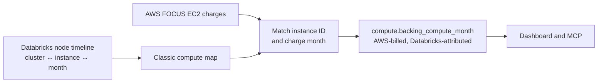

# Backing compute

Classic Databricks clusters can create cloud instances in the customer’s AWS account. Their
DBU usage is billed by Databricks, while the underlying EC2 instances are billed by AWS.
Flashlight identifies the AWS portion supported by Databricks instance metadata—without
adding it to Databricks spend.

## What can be mapped

| Compute type | Separate AWS instance charge? | Included? |
| --- | --- | --- |
| Classic Databricks cluster | Yes. The customer account has a visible cloud instance. | Yes, when the instance and month match the telemetry map. |
| Serverless Databricks service | No customer-visible instance in the customer account. | No. There is no AWS instance cost to attribute. |
| Other EC2 resources | Potentially billed by AWS, but not shown as a Databricks instance. | No. They remain AWS spend. |

## The accounting boundary

Backing compute is a cross-cloud attribution, not a combined Databricks total:

- AWS remains the **billing provider** and retains the EC2 cost in `aws.monthly_bill`.
- Databricks is the **platform provider** whose node telemetry supports the match.
- The result is published in the separate `compute` GOLD group, never in the Databricks
  spend group.

This avoids the most misleading outcome: counting a single EC2 charge once as AWS spend and
again as Databricks spend.

## Coverage and limitations

The mapped amount is a floor. It covers classic compute only and only for periods where the
Databricks node timeline was available during ingestion. The timeline has finite retention,
so Flashlight cannot reconstruct an instance-to-cluster relationship for a historical month
that was never collected.

An unmatched EC2 charge is not evidence that it is unrelated to Databricks; it may be a
non-instance EC2 resource, serverless infrastructure outside the customer account, or a
period without retained telemetry. Flashlight leaves it as AWS cost rather than guessing.

## What is required

Flashlight needs AWS FOCUS data that includes EC2 charges and a Databricks SQL warehouse
that can read the node timeline. The [AWS connector](../connectors/aws.md) and
[Databricks connector](../connectors/databricks.md) describe the required permissions and
the queries/calls involved.
