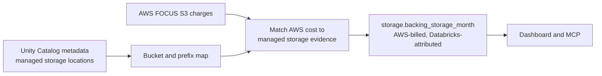

# Backing storage

Databricks usage and AWS storage are separate bills. Flashlight can identify the AWS S3
storage cost associated with Databricks-managed Unity Catalog storage, but it never adds
that AWS cost to Databricks spend.

The result is a clearly labelled cross-cloud attribution view, not a blended TCO total.

## What is included

Unity Catalog metadata identifies the storage locations Databricks manages. AWS FOCUS
records identify what the corresponding S3 resources cost.

| Storage relationship | Included as Databricks backing storage? | Reason |
| --- | --- | --- |
| Unity Catalog metastore root | Yes | It is Databricks-managed storage. |
| Catalog storage root | Recorded for inventory; mapped only when evidence supports it | Metadata helps explain coverage, but must not over-claim cost. |
| External location | No | The data belongs to another pipeline or team; charging it to Databricks would double-count. |
| Unmapped S3 | No | It stays visible as AWS spend without an unsupported Databricks attribution. |

## The accounting boundary

Every backing-storage record identifies both sides of the relationship:

- **Billing provider:** AWS—the issuer of the S3 charge.
- **Platform provider:** Databricks—the platform whose managed-storage metadata supported
  the attribution.

The amount remains in AWS spend. The separate `storage` GOLD group prevents it from being
written into `databricks.monthly_bill`, so a cross-provider total cannot accidentally count
the same cost twice.

## What the result means

The mapped number is a conservative floor, not “all storage used by Databricks.” Some
managed locations may not be identifiable from the available metadata, and the mapping
does not claim unrelated S3 or external data-lake spend. Under-attribution is preferable to
silently assigning another team’s storage bill to Databricks.

The storage view also preserves S3 cost subcategories, such as storage, requests, and data
transfer. These are different operational questions: growing stored data and high request
volume do not have the same remedy.

## What is required

Flashlight needs:

1. AWS FOCUS data that includes S3 charges.
2. Databricks metadata access sufficient to read the relevant Unity Catalog locations.

The [AWS connector](../connectors/aws.md) and
[Databricks connector](../connectors/databricks.md) document the exact permissions and
calls. The mapping is best-effort: a missing metadata grant reduces coverage; it does not
turn missing evidence into a zero-cost conclusion.
