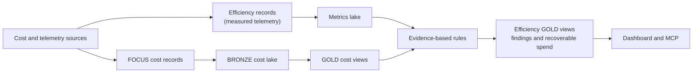

# Efficiency and recoverable spend

Cost data tells us **what was billed**. It cannot, by itself, tell us whether a
resource was used well. An idle cluster and a productive cluster can have the same FOCUS
cost record. Flashlight therefore uses a small, separate telemetry plane to answer a
different question: *what portion of billed capacity has measured evidence of being
recoverable?*

This is an implementation concept, not a setup guide. To add a source, use
[Connect a real source](../getting-started/real-source.md). To see available results, use
the dashboard's **Efficiency & Waste** view or the MCP metric catalog.

## Why this is separate from cost

FOCUS is the canonical contract for cost and remains the source of truth for totals.
Utilization, activity, queueing, and operational health have a different grain and do not
fit a billing line item. Combining the two would make the cost model less reliable and
would encourage the product to invent a utilization signal where none exists.

Instead, a connector may emit an `EfficiencyRecord` for a measured entity and month. It
contains the minimum shared context needed to assess a finding:

| Field | Purpose |
| --- | --- |
| Entity and month | Identifies the actionable thing being assessed, such as a job, cluster, warehouse, bucket, or table. |
| Billed cost | Connects the operational signal to the related cost, when that relationship is measurable. |
| Utilization or activity | Provides the observed evidence for an idle or underutilized finding. A missing value means Flashlight does not claim utilization. |
| Owner / project | Supports attribution when the source can provide it. |
| Cause detail | Retains provider-specific evidence without making the shared record model provider-specific. |

Records are aggregated at the source to an actionable monthly grain. Flashlight does not
store every job run or query execution merely to produce a dashboard finding.

## What the pipeline guarantees

- **Cost is not overwritten.** FOCUS-backed GOLD views continue to provide headline spend.
- **Evidence is explicit.** A finding is based on a connector-supplied signal, not an LLM
  inference or a generic percentage applied to every bill.
- **Readers agree.** Dashboard and MCP read the same published GOLD views and the same
  rule results.
- **Publishing stays safe.** Ingest and transform publish complete Parquet outputs
  atomically, so readers do not see a half-built result.
- **A telemetry failure does not corrupt cost.** An optional efficiency pull can fail
  without discarding an otherwise successful cost ingest. The missing evidence is not
  presented as a clean bill of health.

## What a finding means

The efficiency views distinguish measured waste from an opportunity or an operational
signal:

| Result | Meaning |
| --- | --- |
| **High-confidence recoverable spend** | The available evidence supports a specific, priced finding—for example, billed capacity with no measured activity. |
| **Candidate opportunity** | The signal is useful for review but requires owner/context validation before treating it as a saving. |
| **Unpriced operational signal** | A performance or configuration concern is visible, but Flashlight does not have an honest dollar estimate. |
| **No finding** | Not evidence that a resource is healthy. It can mean no rule matched, the source did not expose the required telemetry, or the source has not been synced for that period. |

“Recoverable” is therefore an estimate of the cost a justified change could avoid. It is
not an instruction to terminate a resource, an automated remediation, or a guaranteed
saving.

## Coverage and limitations

Coverage is source-specific. A connector only evaluates rules supported by the telemetry it
can read, and rules remain inactive until their required signal exists. In particular,
Flashlight does not manufacture per-user utilization for shared compute, and it does not
assign a dollar amount to a performance signal when a defensible allocation is unavailable.

Use the following sequence when evaluating a result:

1. Check the source and time window: an initial sync should include at least six months.
2. Inspect the finding's evidence, confidence, and scope in the dashboard or metric view.
3. Confirm ownership and workload context with the team that operates the resource.
4. Treat a remediation as a change-management decision, then re-measure the outcome in a
   later period.

## Where to go next

- [GOLD views and metrics](../concepts/gold-views.md) explains the shared published-data
  contract.
- [Databricks connector](../connectors/databricks.md),
  [Amazon Redshift connector](../connectors/redshift.md), and
  [AWS connector](../connectors/aws.md) document the permissions, telemetry, and queries
  each source uses.
- [MCP tools](../reference/mcp-tools.md) documents how an agent discovers and queries the
  published views.
