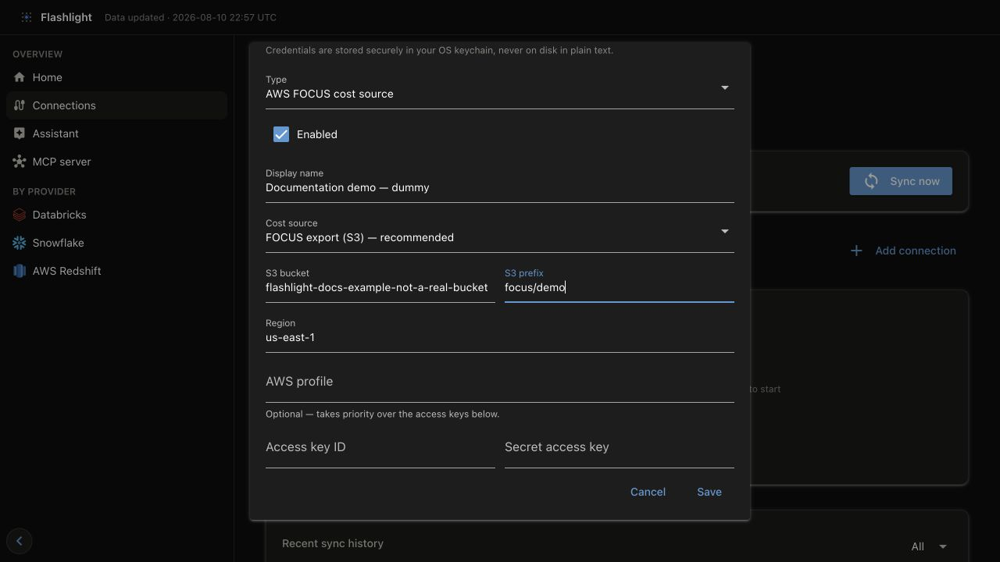
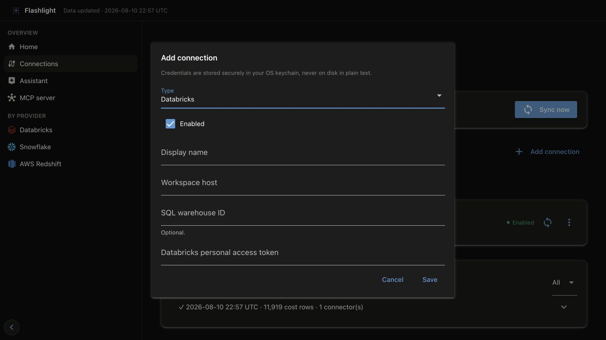
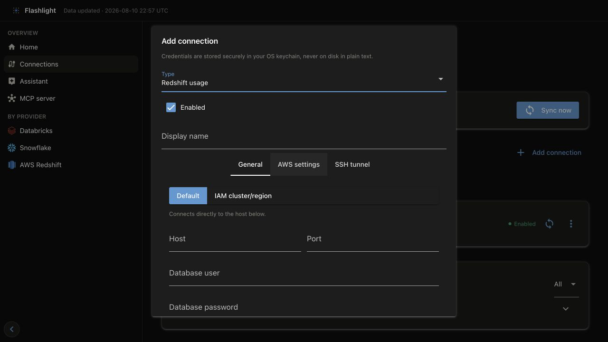
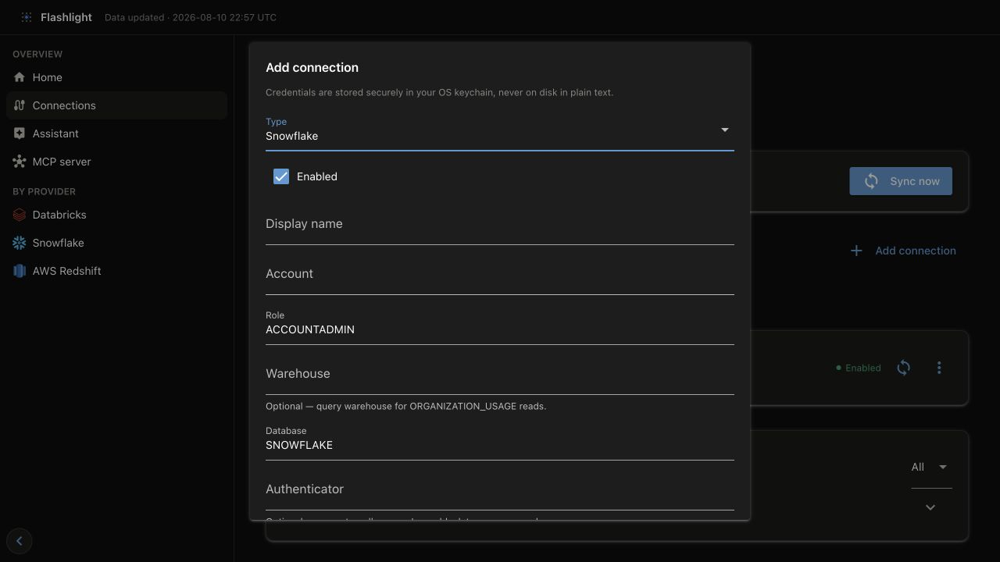
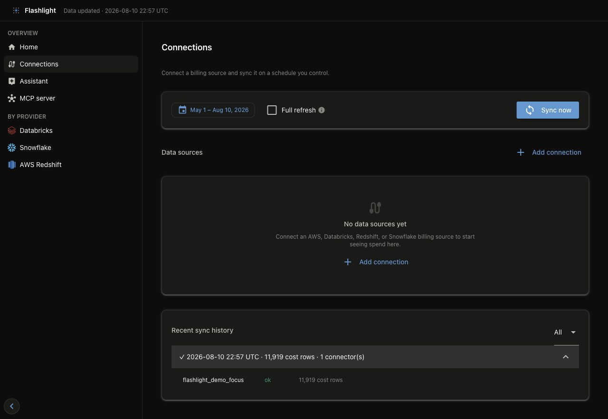

# Connect a real source

The dashboard is the primary setup path. On **Connections**, you add a source, store its
credentials securely, choose the period to pull, and inspect the result in one place. The
example below uses a deliberately nonexistent S3 destination so you can see what is saved
without exposing a real account or credential. **Do not sync the example values.**

## 1. Start at Connections

Launch the dashboard and open `http://127.0.0.1:8501`, then select **Connections** in the
left navigation. On a new lake, Flashlight creates its starter configuration when this page
first opens.

```bash
flashlight dashboard serve
```


*Connections is the setup and operator surface: add a source first, then choose the window
to pull and start a sync.*

## 2. Add a source

Select **Add connection**, choose the provider, and complete its form. The example selects
**AWS FOCUS cost source**, the preferred AWS cost path. Its display name and S3 destination
are intentionally fake; the empty credential fields are intentional too.



### What the AWS FOCUS fields mean

| Field | Required? | Why Flashlight needs it |
| --- | --- | --- |
| **Type** | Yes | Selects the connector and its expected source. Choose **AWS FOCUS cost source** for an AWS Data Export, not for Redshift telemetry. |
| **Enabled** | Usually | Includes this connection in **Sync now**. Clear it to retain the definition without pulling it. |
| **Display name** | Recommended | Identifies the source in Connections, sync history, local provenance, and targeted sync actions. Use a stable, human-readable name. |
| **Cost source** | Yes | **FOCUS export (S3)** reads detailed FOCUS Parquet and is the recommended path. Cost Explorer is a less-detailed fallback. |
| **S3 bucket** | Yes for FOCUS export | Names the bucket that receives the AWS Data Export. Flashlight lists manifests and reads only the Parquet files they name. |
| **S3 prefix** | Yes for FOCUS export | Narrows access and tells Flashlight where the export root lives. It should match the export delivery path, not an unrelated parent bucket. |
| **Region** | Yes | Sets the AWS client and S3 region; the form starts with `us-east-1`. Use the region of the destination bucket/export setup. |
| **AWS profile** | Optional | Uses a named local AWS profile. When set, it takes precedence over the access-key fields. |
| **Access key ID / Secret access key** | Optional | A direct credential option when a profile or ambient AWS credential chain is not used. Enter them only into the secure fields; never put them in prose, screenshots, or `connections.yml`. |

The same principle applies to every connector: the saved connection describes *where* to
read and the secret reference; secure fields store the secret outside the YAML file. Read
the provider guide before saving a real source because it specifies the permissions,
queries, and telemetry data involved.

### Add Databricks, Redshift, or Snowflake

The same **Add connection** dialog changes its fields when you change **Type**. Add each
source separately; an AWS FOCUS connection supplies AWS cost data, while Redshift is a
telemetry connection and does not replace it.

| Type | Enter in the form | Optional choices | Before saving |
| --- | --- | --- | --- |
| **Databricks** | Display name, workspace host, personal access token | SQL warehouse ID | Use the workspace host (including `https://`). The warehouse ID limits the SQL endpoint used for system-table reads. |
| **Redshift usage** | Display name plus either direct host/database credentials or an IAM cluster/region path | AWS settings and an SSH tunnel | Select **Test connection**. The tabs expose only the connection method you need. |
| **Snowflake** | Display name, account, user, and password or key-pair details | Role, warehouse, database, authenticator, private key path | A warehouse is needed for `ORGANIZATION_USAGE` reads; use a role with only the documented grants. |







Every secret field in these forms is stored in the operating system's credential store, not
in `connections.yml`. The connector pages explain exactly which permissions are needed and
which queries the connection performs: [Databricks](../connectors/databricks.md),
[Amazon Redshift](../connectors/redshift.md), and [Snowflake](../connectors/snowflake.md).

## 3. Save and confirm the source

Select **Save**. The connection appears in **Data sources** with its provider, display name,
destination, and enabled state. This confirms that the local configuration was saved—it does
not prove that the identity can read the cloud source.


*This screenshot is a documentation fixture. `flashlight-docs-example-not-a-real-bucket` is
intentionally invalid, and no credentials were saved.*

For a real source, use **Test connection** before the first sync when that action is offered
(notably for Redshift). For AWS, confirm the bucket/prefix and IAM permissions in the
[AWS connector guide](../connectors/aws.md) before pulling data.

## 4. Sync at least six months of real data

After replacing the dummy values with a real, permissioned source, choose a continuous window
of **at least the last six months** in the Connections toolbar and select **Sync now**. This is
the useful baseline for month-over-month changes, trends, and savings analysis. The sync dialog
shows live output; the page records the final result in **Recent sync history**.

If you need to validate a new identity, use **Test connection** where it is available before
the six-month sync. For an AWS FOCUS source, validate the bucket, prefix, and IAM policy from
the [AWS connector guide](../connectors/aws.md) first; then sync the six-month window rather
than treating a one-week pull as a complete setup.



*Expand a history row to verify which connector ran and how many cost records it produced.
Open a failed row's log before retrying.*

Flashlight publishes data from successful connectors even when an independent connector
fails. Treat a failed or partial sync as something to resolve before relying on a
cross-provider total.

## 5. Verify the result

Use **Home** to confirm the selected period has data, then open the provider page to check
the billing account, currency, scope, and total. Reconcile only matching periods and scope;
see [FOCUS and cost integrity](../concepts/focus-and-integrity.md) for the rules.


*The overview confirms that published metrics are available. Provider pages supply the
detail needed to investigate a total.*

## Connector guides

| Source | Primary use | Permissions and query guide |
| --- | --- | --- |
| AWS FOCUS Data Export | Canonical AWS cost data | [AWS](../connectors/aws.md) |
| Databricks system tables | Databricks cost and operational telemetry | [Databricks](../connectors/databricks.md) |
| Amazon Redshift | Redshift efficiency telemetry; AWS provides its costs | [Amazon Redshift](../connectors/redshift.md) |
| Snowflake | Organization cost and optional driver health | [Snowflake](../connectors/snowflake.md) |

## CLI alternative

Use the CLI when the dashboard is unavailable or a scheduler owns the workflow. Initialize
the starter files, supply secrets through the environment or your secret manager, and run a
bounded ingest:

```bash
flashlight init
flashlight ingest --start 2026-07-01 --end 2026-07-31
```

The CLI and the dashboard use the same connection configuration and publish the same GOLD
metrics. Read the [CLI reference](../reference/cli.md) for automation-specific options.
