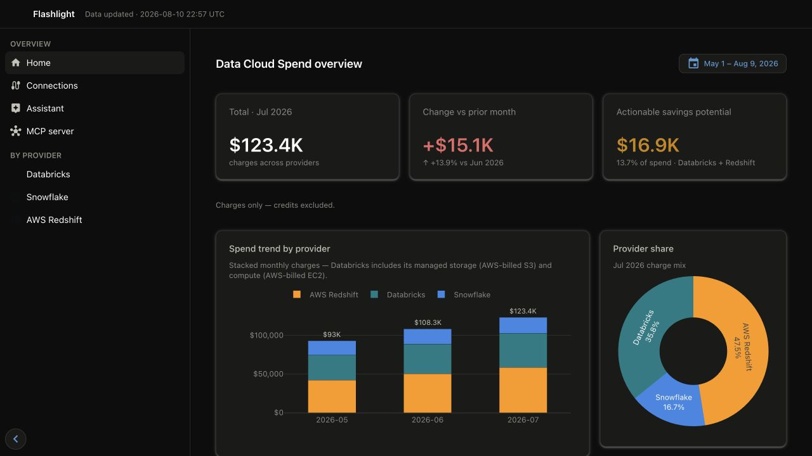
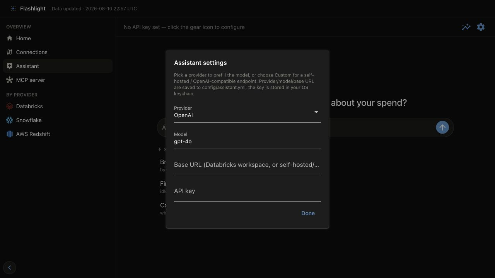

# Explore the dashboard

Start the local dashboard:

```bash
flashlight dashboard serve
```

By default it listens at `http://127.0.0.1:8501`. The dashboard is the primary operator
surface: **Connections** manages source setup and syncs, while its provider pages explain
the published results. It is otherwise a read-only consumer of GOLD data; it never changes
cloud resources.

## First workflow

1. Open **Connections** and add a source.
2. Choose a continuous six-month (or longer) date range and select **Sync now**.
3. Follow the live sync output, then check **Sync history** for the completed result.
4. Open **Home** for cross-provider movement, then the provider page for the source you
   connected to validate scope and drill into the spend.

Use the [Connect a real source](../getting-started/real-source.md) guide for the full
connection workflow and its CLI alternative.



*The overview is the first verification surface after a successful sync; provider pages add the detail needed to investigate a number.*

## What the dashboard answers

| Area | Use it to answer |
| --- | --- |
| Overview and provider views | What did we spend, and where did it change? |
| Attribution | Which account, project, owner, tag, or resource drives spend? |
| Efficiency / waste | Which billed capacity is likely recoverable, and why? |
| Policy | Which platform settings meet or miss policy thresholds? |
| AI costs | Which endpoints, models, and requesters drive AI spend and token use? |
| Backing compute and storage | What infrastructure cost sits behind a managed platform? |
| Driver health | Which drivers or workloads show operational risk signals? |

## Read numbers responsibly

Every cost chart uses the GOLD view's declared cost measure. Flashlight uses
`EffectiveCost` as the canonical cost metric and preserves credits/refunds as negative
values. Waste is a measured or rule-based recoverable-spend estimate, not an automatic
remediation recommendation. Read [FOCUS and cost integrity](../concepts/focus-and-integrity.md)
before reconciling a chart to a provider invoice.

## Dashboard assistant

The optional assistant translates questions into the same MCP metric operations used by
external agents. Open **Assistant** in the left navigation, then use the settings icon to
choose the provider and model. Enter the API key only in the dialog: the dashboard stores it
in the OS keychain, while `config/assistant.yml` stores only provider, model, and optional
base URL. It does not mutate billing data or cloud resources.



Use **Custom** when a self-hosted or OpenAI-compatible endpoint needs an explicit base URL.
For headless deployments, configure `FLASHLIGHT_ASSISTANT_PROVIDER`,
`FLASHLIGHT_ASSISTANT_MODEL`, `FLASHLIGHT_ASSISTANT_BASE_URL`, and the API key through the
deployment's secret store.
