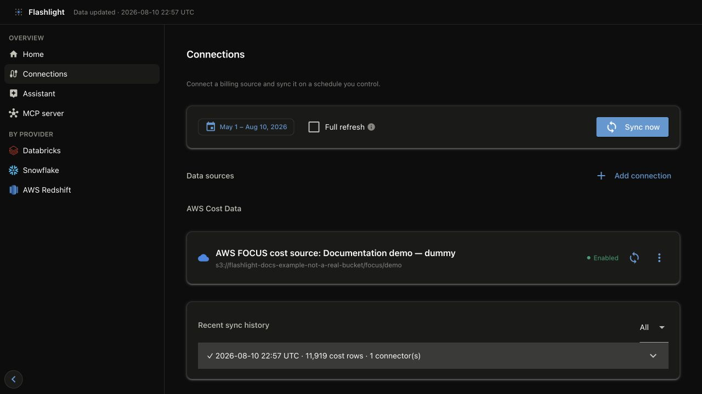

# Sync and manage data

For routine operation, run syncs from the dashboard's **Connections** page. It gives the
operator a date-range control, live output, sync history, and a per-source action without
requiring terminal access. The CLI is the equivalent path for scheduled or headless runs.

## Run a sync in the dashboard

1. Open **Connections**.
2. Choose the source-pull date range. The page initially selects the trailing three months.
3. Select **Sync now** to refresh every enabled source, or use the sync icon beside one
   source to validate or refresh only that connection.
4. Keep the sync dialog open to follow progress. Select **View log** if a sync is already
   running in another dashboard tab.
5. Review **Sync history** when it finishes. Open a failed row's log before retrying.



*Use a bounded date range for first-time validation. **Full refresh** is for deliberately replacing retained connector history.*

The dashboard runs one sync at a time for a lake. It invokes the same writer process as the
CLI, so it replaces the affected connector/month partitions and atomically publishes the
updated GOLD views for dashboard and MCP readers.

## Full refresh and history

Enable **Full refresh** only after changing a connector's mapping or when you intend to
replace its retained history. It removes the connector's existing BRONZE history before
pulling the selected window. Choose an explicit, sufficiently broad date range first;
otherwise the selected window becomes the retained history.

Normal syncs are idempotent for their requested connector/month partitions. A connector
failure does not discard data successfully published by other connectors, but it does make
the run partial—review the log before comparing a combined total.

## Schedule it

The dashboard is best for a person-operated sync. For a recurring job, use your scheduler
with the same `FLASHLIGHT_HOME`, connection configuration, and secret environment. Only one
writer should own a lake location.

```bash
flashlight ingest
```

Useful automation variants:

| Goal | Command |
| --- | --- |
| Refresh one configured source | `flashlight ingest --connector "Prod cost"` |
| Run a reproducible backfill | `flashlight ingest --start 2026-01-01 --end 2026-06-30` |
| Pull data but delay metric rebuild | `flashlight ingest --no-transform` |
| Rebuild GOLD from existing BRONZE data | `flashlight transform` |
| Replace a connector's retained history | `flashlight ingest --full-refresh --start … --end …` |

The dashboard and MCP server can run while a sync is in progress: they consume immutable,
published GOLD files. See [Data architecture](../architecture.md) for the publishing model.

## Clean up safely

Cleanup is intentionally CLI-only because it removes local lake data. Preview the exact
target first, then confirm the destructive action:

```bash
flashlight cleanup --dry-run
flashlight cleanup
```

To scope cleanup to one source, use `flashlight cleanup --connector aws_focus`; Flashlight
rebuilds GOLD from the data that remains.
