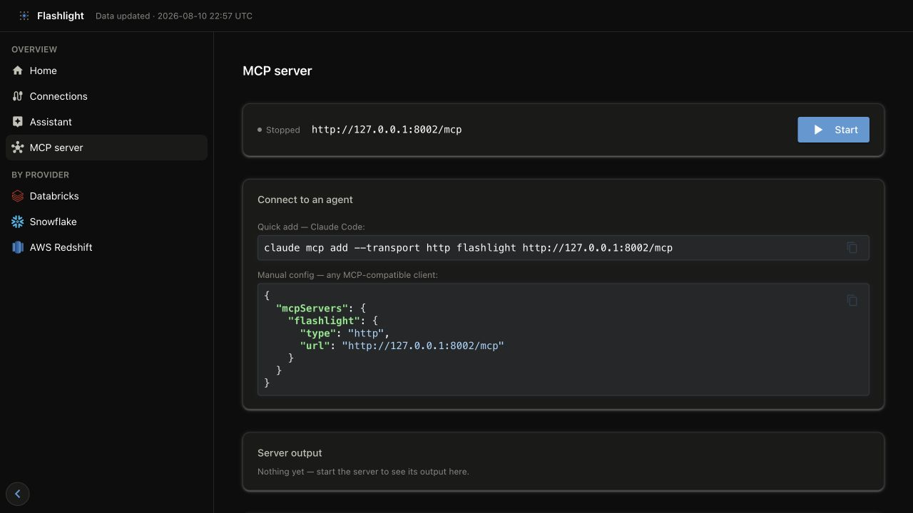

# Use Flashlight with agents

Flashlight exposes a streamable HTTP MCP server over the published GOLD metrics. The
server and dashboard intentionally share the same reader, metric catalog, and data files.

## Start the server from the dashboard

Open **MCP server** in the dashboard's left navigation and select **Start**. The page shows
the endpoint, live process output, the exact client configuration, and the tools the running
server exposes. It starts the same local server as the CLI command below; it does not start a
second implementation or write to the lake.



Copy the **Quick add** command for Claude Code or the **Manual config** JSON for another
MCP-compatible client. The default endpoint is `http://127.0.0.1:8002/mcp`.

## CLI alternative

```bash
flashlight mcp serve
```

The default endpoint is `http://localhost:8002`. Configure `FLASHLIGHT_MCP_HOST` and
`FLASHLIGHT_MCP_PORT` for another private endpoint.

!!! danger "Do not expose the default server publicly"

    MCP has no built-in authentication in Flashlight. It exposes metric discovery and
    read-only SQL. Bind it to localhost/private networking or add authentication at a
    reverse proxy before sharing it.

## Recommended agent workflow

1. Call `list_metrics` to discover published views.
2. Call `describe_metric` to learn valid dimensions and measures.
3. Use `list_dimension_values` to discover filter values.
4. Use `query_metric` for bounded, structured results.
5. Use `run_sql` only for analysis that cannot be expressed through a metric view.

See [MCP tools reference](../reference/mcp-tools.md) for exact inputs and return shapes.

## Data availability

Run `flashlight ingest` or `flashlight sample` before starting MCP. If GOLD has not been
published, metric views are empty. MCP never triggers an ingest and never changes a source
or the local lake.
