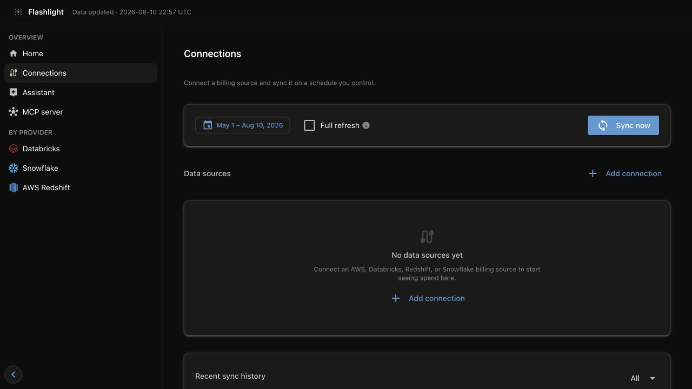

# Quick start

## 1. Install

```bash
pip install getflashlight        # or: uv sync (from the repo)
```

**Cross-platform.** The lake home defaults to the OS user-data dir
(`platformdirs`) — `~/Library/Application Support/flashlight` on macOS,
`%LOCALAPPDATA%\flashlight\flashlight` on Windows, `~/.local/share/flashlight` on Linux
— or set `FLASHLIGHT_HOME` to override. Secrets load from a `.env` in the working
directory or the process environment in headless use. When entered through the dashboard,
they are stored in the operating system credential store instead (real shell env wins).

## 2. Open the dashboard

```bash
flashlight dashboard serve      # dashboard → http://127.0.0.1:8501
```

Open `http://127.0.0.1:8501`. The dashboard is the primary path for adding a connection,
testing it, choosing a sync window, watching the sync log, and exploring the resulting
metrics. It creates starter configuration on first use.

## 3. Connect and sync from the UI

1. Select **Connections** in the left navigation.
2. Select **Add connection** and choose AWS, Databricks, Amazon Redshift, or Snowflake.
3. Enter the source details and credentials, then select **Save**. The dashboard keeps
   credentials in your OS keychain rather than writing them to `connections.yml`.
4. Select a continuous date range of at least six months and choose **Sync now**. This gives
   charts enough history for trends, month-over-month movement, and savings analysis.
5. Follow the live log, then open the relevant provider page to verify the result.



*The dashboard keeps connection setup and the source-pull controls together on **Connections**.*

For the complete workflow, permissions, and every query Flashlight triggers, see
[Connect a real source](getting-started/real-source.md).

## Optional: load sample data

The demo generator is a CLI convenience: it creates deterministic, fully local FOCUS cost
records plus linked Redshift, Databricks, and Snowflake telemetry, then rebuilds the same
GOLD views used in production.

```bash
flashlight sample
```

For an isolated demo, set `FLASHLIGHT_HOME` to a dedicated directory before running both
the sample command and the dashboard, so mock and real data cannot mix.

## Optional: use the CLI

Use commands for automation, CI, and headless environments. The CLI produces the same lake
and the same published metrics as the dashboard:

```bash
flashlight init
flashlight ingest
```

## Other local surfaces

| Surface | Command | Where |
|---|---|---|
| Dashboard (humans) | `flashlight dashboard serve` | http://127.0.0.1:8501 |
| MCP server (agents) | `flashlight mcp serve` | http://localhost:8002 (streamable-http) |

Both are independent read-only processes over the published GOLD Parquet —
`ingest` is the only writer.

You can also start, stop and watch the MCP server from the dashboard's **MCP server**
page, which shows its status, the endpoint to paste into a client, and the tools it
exposes. A server started there is a child of the dashboard, so it exits with it — use
the CLI (or a service manager) for one that outlives it. Either way the port has **no
authentication** and serves ad-hoc read-only SQL over your lake, so keep
`FLASHLIGHT_MCP_HOST` on `127.0.0.1` unless you mean to expose it.

## Next steps

Your config lives in `<home>/config/`. The Connections page manages normal source setup;
the files remain useful for version-controlled or automated deployments:

| File | What it holds |
|---|---|
| `connections.yml` | the billing sources to ingest |
| `policies.yml` | cost-policy threshold overrides |
| `assistant.yml` | which LLM the BYOK assistant uses (provider / model / base URL) |

None of them ever holds a secret — credentials go to your OS keychain, or to the env
vars the config names.

Environment overrides, defaults shown:

```bash
FLASHLIGHT_HOME=                          # lake root; default: platform user-data dir
FLASHLIGHT_BASE_CURRENCY=USD              # ingest asserts all rows match this
FLASHLIGHT_CONNECTIONS_PATH=              # default: <home>/config/connections.yml
FLASHLIGHT_PARQUET_COMPRESSION=zstd
FLASHLIGHT_PARQUET_COMPRESSION_LEVEL=3    # zstd 1-22
FLASHLIGHT_MCP_HOST=0.0.0.0
FLASHLIGHT_MCP_PORT=8002
FLASHLIGHT_DASHBOARD_HOST=127.0.0.1
FLASHLIGHT_DASHBOARD_PORT=8501
FLASHLIGHT_ASSISTANT_PROVIDER=            # overrides config/assistant.yml
FLASHLIGHT_ASSISTANT_MODEL=
FLASHLIGHT_ASSISTANT_BASE_URL=
FLASHLIGHT_ASSISTANT_API_KEY=             # only if no OS keychain is reachable
```

- [Ingest and manage data](guides/ingest.md) covers refreshes, backfills, and cleanup.
- [Explore the dashboard](guides/dashboard.md) explains the product surfaces and metric semantics.
- [FOCUS and cost integrity](concepts/focus-and-integrity.md) explains how to reconcile totals.
